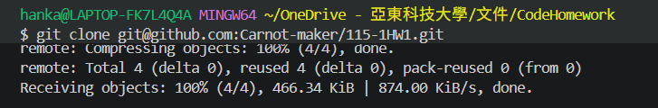
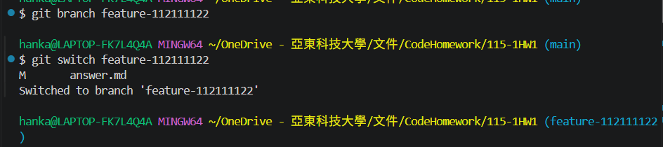
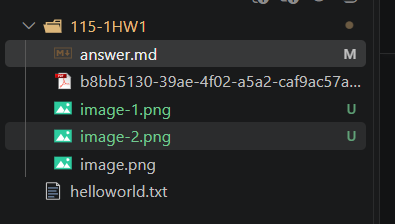
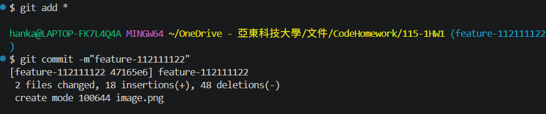
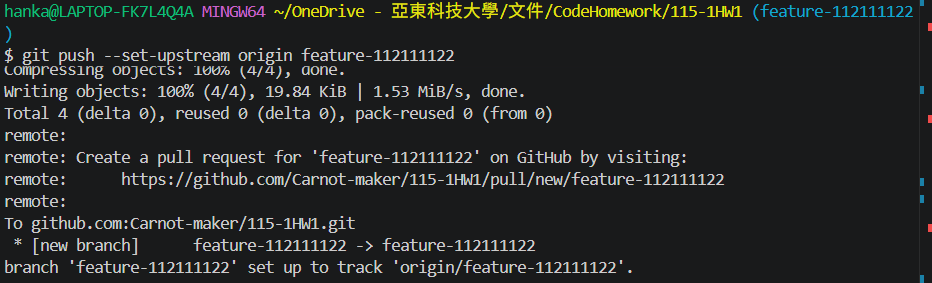

# 第1次作業題目-隨堂-HW1
>
>學號：112111122 (換成自己的)
> 
>姓名：周廉恆 (換成自己的)
> 
>作業撰寫時間：
> 
>最後撰寫文件日期：2023/09/30 (換成自己的)
>

### 1. 

Ans:
先fork目標倉庫，隨後複製SSH金鑰。

### 2. 

Ans:
markdown語法常見於如Notion、Obsidian等筆記軟體。

使用`#`可以區分標題、小標題等。

用`1. `可以製造出list順序編排。

用` --- `可以劃出分隔線。

用` - [ ]  `可以造出清單。

### 3. 

Ans:

- 創建並使用該分支

- 創建新內容

- 將欲變動之內容選擇出來，放入預備區；確定上傳時提交內容，並產生版本。

- 在所在的分支(branch)變動從本地端倉庫推向伺服器端的倉庫進行更新。

